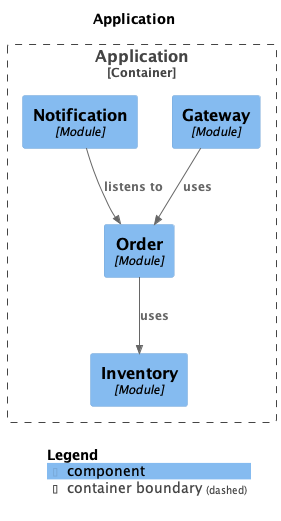
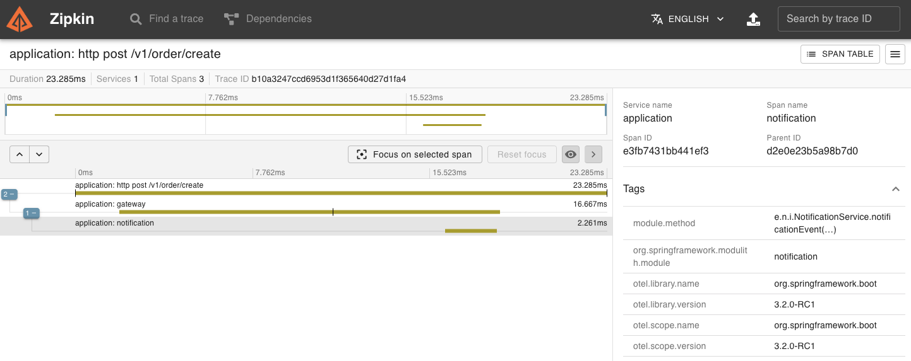

# Spring Modulith Jigsaw

<div align="justify"> Showcasing Spring Modulith's power to assemble an application like a jigsaw puzzle of cohesive modules. This repository serves as a demonstration and reference to implement and use the new Spring Modulith feature.

Spring Modulith supports developers implementing logical modules in Spring Boot applications. It allows to apply structural validation, document the module arrangement, run integration tests for individual modules, observe the modules interaction at runtime and generally implement module interaction in a loosely-coupled way. [(Click here to learn more)](https://docs.spring.io/spring-modulith/docs/1.0.0/reference/html/) </div>

## Project Overview

<div align="justify"> 



In this repository, you'll find a sample application that demonstrates some of the key concepts of Spring Modulith. The project is organized into four modules: `gateway`, `inventory`, `notification` and `order`. The component diagram on the right describes the architecture of this example project. Please note the following:
* The purpose of this project is just to showcase some of the most important features available with Spring Modulith.
* The diagram presented was generated using Spring Modulith documentation capabilities, available via `ApplicationModules` class. In addition to being able to generate component diagrams in UML and C4, this feature also allows to generate a so-called _Application Module Canvas_, a tabular overview about the module and the most relevant elements in those. This can be achieved by running the Unit Test `renderDocumentation()` available in the `ModularityTests` class.
  <br clear="left"/>

</div>

## Bonus 🎉

In addition to showcasing the Spring Modulith architecture, this project incorporates the following features:

### Observability

Interactions between application modules are instrumented to generate Micrometer spans, which are then aggregated into traces that can be visualized using tools like Zipkin. When you start the application, Spring Boot will automatically attempt to launch a Docker container for Zipkin. To access the Zipkin dashboard, open your web browser and navigate to http://localhost:9411.



### Event-Based Communication

To keep application modules as decoupled as possible from each other, their primary means of interaction should be event publication and consumption. This avoids the originating module to know about all potentially interested parties, which is a key aspect to enable application module integration testing. This application is making use of Application Events to showcase how can this be achieved by using `@ApplicationModuleListener` annotation. 

Another intriguing aspect of Spring Modulith is the Event Publication Registry. Spring Modulith includes a built-in event publication registry that seamlessly integrates with the core event publication mechanism of the Spring Framework. To delve deeper into this topic, you can find more information by following this [link](https://docs.spring.io/spring-modulith/docs/1.0.0/reference/html/#events.publication-registry).

## Requirements

Before you get started, ensure you have the following software installed on your system:

- [Java Development Kit (JDK)](https://www.oracle.com/java/technologies/javase-downloads.html) - You'll need JDK 17 or higher.
- [Maven](https://maven.apache.org/) - A build and dependency management tool.
- [Docker](https://www.docker.com/) - A containerization platform. Ensure that Docker is installed and running on your system.


## How to Run

Follow these steps to run this project on your local machine:

1. Clone the Repository

   ```bash
   git clone https://github.com/MarianaSequeira/spring-modu-jigsaw.git

2. Run the app with the following command:
    ```shell
    $ mvn spring-boot:run
    ```


